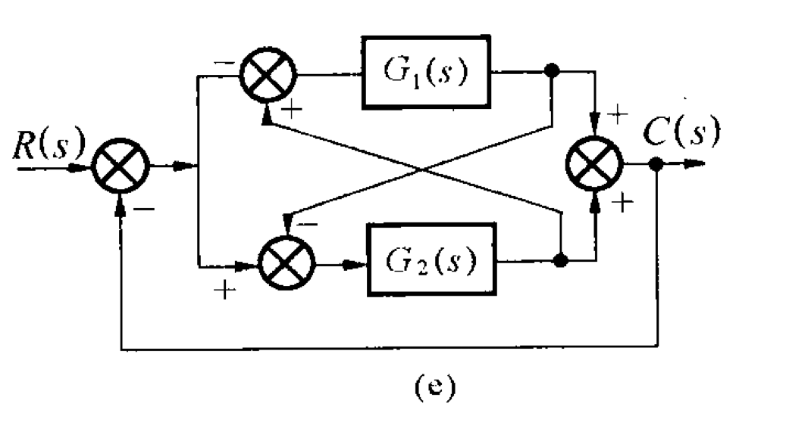

# Matlab 求解方程及数学模型构建

## 实验目的

- 熟悉 Matlab 求解方程及方程组的方法
- 掌握 Matlab 在自动控制原理中的数学模型构建
- 熟悉 Matlab 判断数学模型的稳定性

## 实验内容

### question-1

#### description

利用 Matlab 辅助，计算函数下列函数的零点、极点和增益。(提交代码和结果)

<!-- $$
\frac { C ( s ) } { R ( s ) } = \frac { 5 s ^ { 3 } + 30 s ^ { 2 } + 55 s + 30 } { s ^ { 3 } + 9 s ^ { 2 } + 33 s + 65 }
$$ -->

<div align="center"></div>

#### code

```matlab
num = [5, 30, 55, 30]
den = [1, 9, 33, 65]
[z, p, k] = tf2zp(num, den)
```

#### result

```txt
z =

   -3.0000
   -2.0000
   -1.0000


p =

  -5.0000 + 0.0000i
  -2.0000 + 3.0000i
  -2.0000 - 3.0000i


k =

     5

```

### question-2

#### description

利用 Matlab 辅助，求下图中的传递函数。(提交代码和结果)，其中

<!-- $$
G _ { 1 } = \frac { s + 2 } { s ^ { 2 } + 6 s + 10 }
$$ -->

<div align="center"></div>

<!-- $$
G _ { 2 } = \frac { s + 1 } { s + 3 }
$$ -->

<div align="center"></div>



#### code

- sinmulink 搭建传递函数系统, 文件名为 `qusetion_2.slx`
- matlab 运行以下代码

```matlab
[A B C D] = linmod2('question_2') % 注意文件名规范, 按照C变量取名, 另外不要加文件后缀名
res_tf = tf(minreal(ss(A, B, C, D)));
%% 以下似乎多余
[num, den] = tfdata(res_tf, 'v');
G = tf(num, den)
```

#### result

```txt
G =

  0.5 s^3 + 4 s^2 + 8.5 s + 4
  ---------------------------
    s^3 + 9 s^2 + 24 s + 20
```

### question-3

#### description

利用 Matlab 辅助，求下列式子(为特征根方程)的极点并判断稳定性。(提交代码和结果)

<!-- $$
s ^ { 6 } + 3 s ^ { 5 } + 5 s ^ { 4 } + 9 s ^ { 3 } + 8 s ^ { 2 } + 6 s + 4 = 0
$$ -->

<div align="center"></div>

#### code

```matlab
den = [1 3 5 9 8 6 4];
p = roots(den);
disp('极点为:')
disp(p);

posi = find(real(p)>0);
num_posi = length(posi);
if num_posi == 0
    disp('稳定')
else
    disp('不稳定')
end
```

#### result

```txt
极点为:
  -2.0000 + 0.0000i
  -1.0000 + 0.0000i
   0.0000 + 1.4142i
   0.0000 - 1.4142i
  -0.0000 + 1.0000i
  -0.0000 - 1.0000i

不稳定
```
