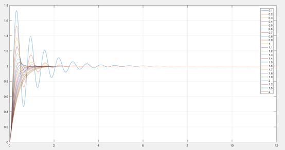
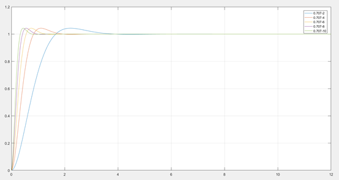
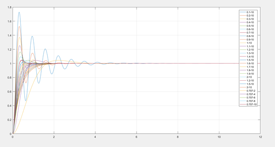

# MatLab 时域分析方法

## 实验目的

- 熟悉 MatLab 时域分析方法
- 掌握 MatLab 求解系统响应的应用。
- 熟悉 MatLab 稳定性分析与指标

## 实验内容

### question-1

#### description

设二阶系统的传递函数为

<!-- $$
G(S)=\frac{\omega_n^2}{s^2+2\xi\omega_ns+\omega_n^2}
$$ --> 

<div align="center"></div>

利用 Matlab 绘制:

> 1. <!-- $\omega _ { n }$ -->  = 10, 而 <!-- $\xi$ -->  = 0.1, 0.2, ..., 1, 1.2, 1.5, 2 的一组单位阶跃响应曲线
> 2. 绘制 <!-- $\xi$ -->  = 0.707，而 <!-- $\omega _ { n }$ -->  = 2, 4, 6, 8, 10 的一组单位阶跃响应曲线，比较两组曲线

#### code

##### part-1

```matlab
t = 0:0.01:12;
wn = 10;
num = [1 * wn^2];

for zeta = [0.1:0.1:2, 1.2, 1.5, 2]
    den = [1, 2 * zeta * wn, 1 * wn^2];
    [y, x, t] = step(num, den, t);
    plot(t, y, 'DisplayName', num2str(zeta))
    hold on
    grid on
end

legend('show')
```
##### result



##### part-2

```matlab
t = 0:0.01:12;
zeta = 0.707;

for wn = [2, 4, 6, 8, 10]
    num = [1 * wn^2];
    den = [1, 2 * zeta * wn, 1 * wn^2];
    [y, x, t] = step(num, den, t);
    plot(t, y, 'DisplayName', [num2str(zeta), '-', num2str(wn)])
    hold on
    grid on
end

legend('show')
```

##### result




#### compare

